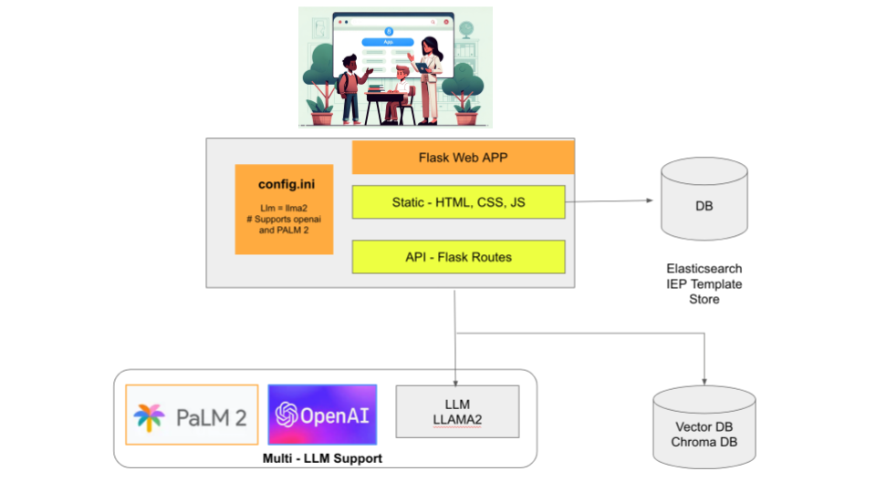

# AI Co-Pilot for Special Needs Education Planning

## Table of Contents
1. [Problem](#problem)
2. [UN SDG Alignment](#un-sdg-alignment)
3. [Solution](#solution)
4. [Architecture](#architecture)
5. [Contribution](#contribution)
6. [License](#license)  <!-- New Section -->

---

## Problem
Specialized Individualized Education Plans (IEP) are crucial for children with special needs. Yet, in underserved areas, the dearth of experts hampers the formulation of effective IEPs, leaving many students without the tailored support they require.

---

## UN SDG Alignment
This project is aligned with UN SDG Goal 4: Quality Education, ensuring inclusive and equitable learning for all.

---

## Solution
Introducing the "IEP Co-Pilot" - an innovative application that harnesses the power of AI to democratize access to specialized education planning.

- **How it works:**
    - Teachers or guardians initiate the app during planning sessions with the student.
    - As conversations ensue, the app records, converts speech to text, and processes this information in real-time.
    - Leveraging techniques like prompt engineering, it collaborates with advanced language models, such as ChatGPT, to formulate a tailored IEP.

- **Unique Features:**
    - This draft IEP isn’t just a generic plan; it's tailored based on the nuances captured during the conversation.
    - Once generated, an educational assistant reviews, validates, and refines the plan.

By acting as a co-pilot, the app doesn’t replace human expertise but amplifies it, making specialized education more accessible. For underserved communities, this doesn’t just bridge a gap; it opens up a world of tailored educational possibilities for those who need it most.

---

## Architecture

---

## Contribution
We welcome contributions from everyone. Feel free to open an issue or create a pull request.

---

## Tools and Technology

### Version Control:
- **GitHub**: We utilized GitHub for our version control needs, enabling a collaborative environment and ensuring smooth code integration.

### Continuous Integration and Deployment:
- **GitHub Actions Workflows**: Allowed us to automate our software development workflows, ensuring code quality and automated deployments.

### Programming Languages and Frameworks:
- **Python 3.11**: The backbone of our backend services.
- **Flask**: A micro web framework written in Python, used for developing our web application.
  
### Search and Database:
- **OpenSearch**: An open-source search and analytics suite, which we employed for efficient data retrieval.
- **ChromaDB**: Our chosen database system for robust data storage and retrieval.

### AI and API:
- **Chat GPT**: Leveraged for natural language processing and enhancing user interaction.
- **LLAMA2 API**: Integrated for [specific function of LLAMA2 API].

### Frontend Development:
- **HTML, JS, CSS**: The core trio of web technologies, forming the foundation of our web application.
- **Bootstrap**: Assisted us in creating a modern and responsive user interface.
  
### Design Principles:
- **Responsive Design**: Ensuring our application looks and functions perfectly across all device sizes.
- **Human Centered Design Principle**: Our approach prioritizes the human perspective in all steps of the problem-solving process, creating solutions that are tailored to the user.

---

## License  
This project is licensed under the GNU General Public License v3.0 - see the [LICENSE](LICENSE) file for details.
